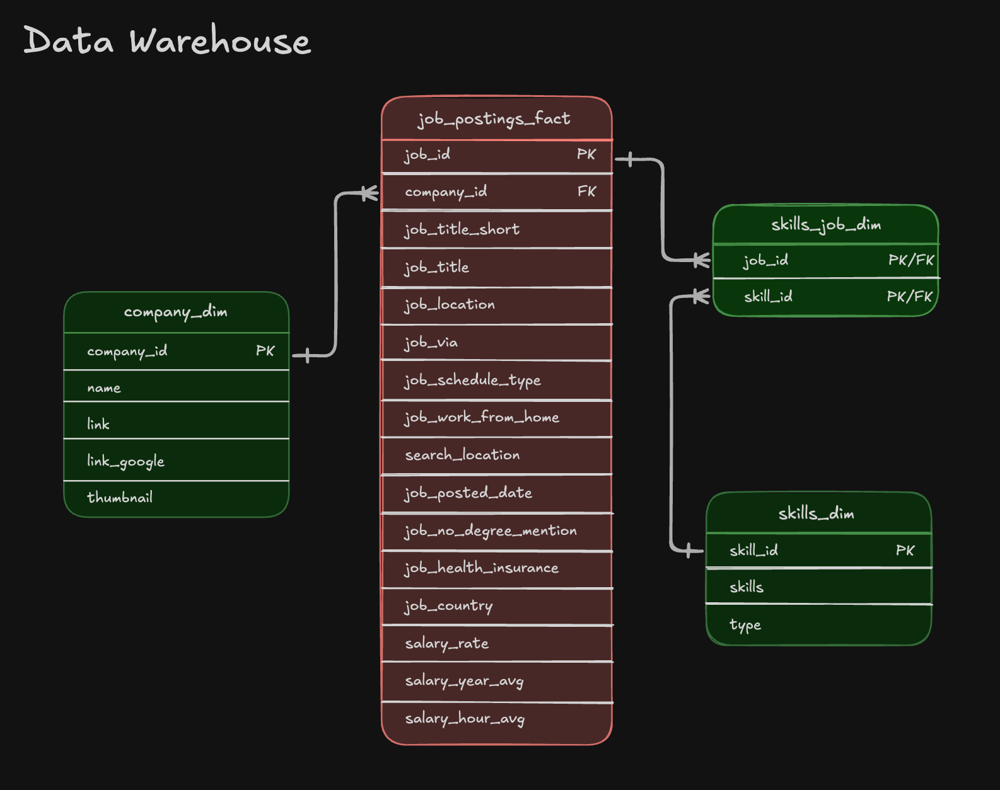

# 🔍 Exploratory Data Analysis w/ SQL: Job Market Analytics


 


# 📊 Data Engineer Job Market — SQL Analysis

A SQL project analyzing the data engineer job market using real-world job posting data. Demonstrates production-quality analytical SQL, efficient query design, and translating business questions into data-driven insights.

---

## 🧾 Executive Summary

| | |
|---|---|
| **Scope** | 3 analytical queries answering key questions about the data engineer job market |
| **Data Modeling** | Multi-table joins across fact and dimension tables |
| **Analytics** | Aggregations, filtering, and sorting to surface top skills by demand, salary, and value |
| **Outcomes** | Actionable insights on SQL/Python dominance, cloud trends, and salary patterns |

**Key files to review:**
- [`01_top_demanded_skills.sql`](1_EDA/01_top_demanded_skills.sql) — demand analysis with multi-table joins
- [`02_top_paying_skills.sql`](1_EDA/02_top_paying_skills.sql) — salary analysis with aggregations
- [`03_optimal_skills.sql`](1_EDA/03_optimal_skills.sql) — combined demand/salary optimization query

---

## 🧩 Problem & Context

Job market analysts need answers to questions like:

- 🎯 **Most in-demand** — Which skills are most frequently required for data engineers?
- 💰 **Highest paid** — Which skills command the highest salaries?
- ⚖️ **Best trade-off** — What is the optimal skill set balancing demand and compensation?

This project queries a data warehouse built on a **star schema** design.



```
job_postings_fact          ← Fact table (titles, locations, salaries, dates)
    ├── company_dim        ← Company information
    ├── skills_job_dim     ← Bridge table (many-to-many: postings ↔ skills)
    └── skills_dim         ← Skills catalog (names and types)
```

---

## 🧰 Tech Stack

| Tool | Role |
|---|---|
| 🐤 DuckDB | Query engine — fast OLAP-style analytical queries |
| 🧮 SQL | ANSI-style with analytical functions |
| 📊 Star Schema | Fact + dimension + bridge table data model |
| 🛠️ VS Code + Terminal | SQL editing and DuckDB CLI |
| 📦 Git / GitHub | Version control for SQL scripts |

---

## 📂 Repository Structure

```
1_EDA/
├── 01_top_demanded_skills.sql    # Demand analysis query
├── 02_top_paying_skills.sql      # Salary analysis query
├── 03_optimal_skills.sql         # Combined demand/salary optimization
└── README.md                     # You are here
```

---

## 🏗️ Analysis Overview

### Query 1 — Top Demanded Skills
Identifies the **10 most in-demand skills** for remote data engineer positions using multi-table joins and aggregation across job postings.

### Query 2 — Top Paying Skills
Analyzes the **25 highest-paying skills**, surfacing median salary and demand count to reveal premium compensation patterns.

### Query 3 — Optimal Skills
Calculates an **optimal score** — combining the natural log of demand with median salary — to identify the most valuable skills to learn from both a market demand and compensation perspective.

---

## 🔑 Key Insights

| Insight | Detail |
|---|---|
| 🧠 **Core languages** | SQL and Python each appear in ~29,000 job postings — the most demanded skills in the market |
| ☁️ **Cloud platforms** | AWS and Azure are critical for modern data engineering roles |
| 🧱 **Infra & tooling** | Kubernetes, Docker, and Terraform are associated with premium salaries |
| 🔥 **Big data** | Apache Spark shows strong demand with competitive compensation |

---

## 💻 SQL Skills Demonstrated

### Query Design & Optimization

- **Complex Joins** — Multi-table `INNER JOIN` across `job_postings_fact`, `skills_job_dim`, and `skills_dim`
- **Aggregations** — `COUNT()`, `MEDIAN()`, `ROUND()` for statistical analysis
- **Filtering** — Boolean logic with `WHERE` clauses and compound conditions
- **Sorting & Limiting** — `ORDER BY DESC` with `LIMIT` for top-N analysis

### Data Analysis Techniques

- **Grouping** — `GROUP BY` for categorical skill-level analysis
- **Mathematical Functions** — `LN()` (natural log) to normalize demand metrics
- **Calculated Metrics** — Derived optimal score combining log-transformed demand with median salary
- **HAVING Clause** — Post-aggregation filtering (skills with ≥ 100 postings)
- **NULL Handling** — Proper exclusion of incomplete salary records (`salary_year_avg IS NOT NULL`)

---
